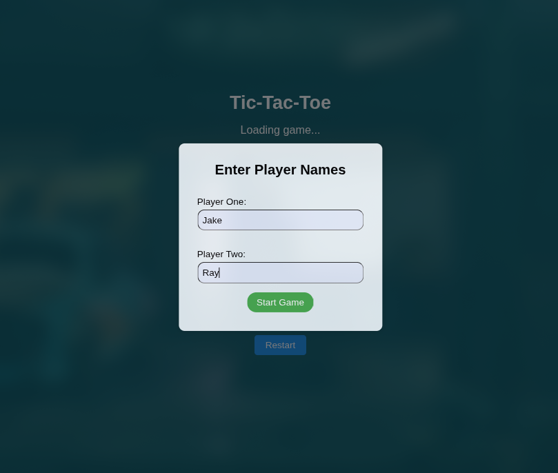
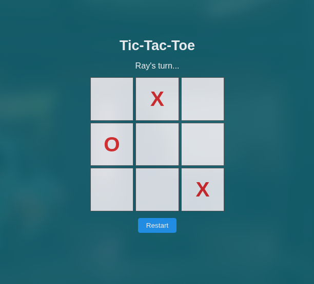

<div id="top"></div>

<!-- HEADER -->
<div align="center">

<!--  -->

# 🎮 TIC-TAC-TOE

</div>

<p align="center">
  A clean, responsive 2-player Tic-Tac-Toe game built with HTML, CSS, and vanilla JavaScript.
  <br />
</p>

<div align="center">

<!-- BADGES -->


</div>

---

## 📚 Table of Contents

- [Overview](#overview)
- [Live Demo](#live-demo)
- [ScreenShots](#screenshots)
- [Features](#features)
- [Project Structure](#project-structure)
  - [Project Index](#project-index)
- [Getting Started](#getting-started)
  - [Prerequisites](#prerequisites)
  - [Installation](#installation)
  - [Usage](#usage)
  - [Testing](#testing)
- [Roadmap](#roadmap)
- [Contributing](#contributing)
- [License](#license)
- [Acknowledgments](#acknowledgments)

---

<a id="overview"></a>

## 🧾 Overview

This project is a simple yet engaging 2-player Tic-Tac-Toe game. It demonstrates modular JavaScript programming using factory functions and manages game state, player interaction, and win conditions without any libraries or frameworks.

---

<a id="live-demo"></a>

### 🎯 Live Demo

👉 [Play Now on GitHub Pages](https://Roland-Front-Back.github.io/Tic-Tac-Toe/)

---

<a id="screenshots"></a>

### 🖼️ Screenshots

<div align="center">
  
  
  

</div>

---

<a id="features"></a>

## ✨ Features

- 🎮 2-player gameplay with custom player name input
- 🏆 Win and tie detection
- 🧠 Modular JS structure using function factories
- ♻️ Restart functionality
- 💻 Fully responsive design
- 📦 No dependencies

---

<a id="project-structure"></a>

## 📁 Project Structure

```sh
Tic-Tac-Toe/
├── README.md
├── index.html
├── assets/
│   ├── css/
│   │   └── styles.css
│   ├── js/
│   │   └── script.js
│   ├── img/
│   │   └── tic-tac-toe.png
│   └── screenshots/
│       ├── start-screen.png
│       ├── gameplay.png
│       └── win-screen.png
```

<a id="project-index"></a>

## 📌 Project Index

| File                  | Description                    |
| --------------------- | ------------------------------ |
| index.html            | Main HTML file and entry point |
| assets/css/styles.css | Contains all styling rules     |
| assets/js/script.js   | Contains the entire game logic |

<a id="getting-started"></a>

## 🚀 Getting Started

<a id="prerequisites"></a>

## 🔧 Prerequisites

- No dependencies or installations required. Just a browser.

<a id="installation"></a>

## 📦 Installation

## Clone the repository:

```sh
git clone https://github.com/Roland-Front-Back/Tic-Tac-Toe
```

## Navigate into the project folder:

```sh
cd Tic-Tac-Toe
```

<a id="usage"></a>

## ▶️ Usage

Simply open index.html in any modern browser:

```sh
open index.html
```

OR

```sh
start index.html
```

<a id="testing"></a>

## 🧪 Testing

There is no automated test framework used yet. You can manually test by playing the game in a browser.

<a id="roadmap"></a>

## 🛣️ Roadmap

- [x] Add player name input
- [x] Handle win/tie detection
- [x] Add restart functionality
- [ ] Add local storage to save scores
- [ ] Add single-player mode (AI)

<a id="contributing"></a>

## 🤝 Contributing

We welcome contributions!

- 💬 Join Discussions

- 🐞 Report Bugs

- 💡 Submit Features

<details> <summary><strong>Contributor Guide</strong></summary>

1. Fork the repo

2. Create a new branch

   ```sh
   git checkout -b feature/your-feature-name
   ```

3. Commit your changes

   ```sh
   git commit -m "Add your message"
   ```

4. Push to GitHub

   ```sh
   git push origin feature/your-feature-name
   ```

5. Open a Pull Request
</details>

<br>

<details> <summary><strong>Contributor Graph</strong></summary> <br>
<p align="left"> 
<a href="https://github.com/Roland-Front-Back/Tic-Tac-Toe/graphs/contributors"> 
 </a> 
</p> 
</details>

<a id="license"></a>

## 📝 License

This project is licensed under the MIT License.

<a id="acknowledgments"></a>

## 🙌 Acknowledgments

    Flaticon for the game icon

    JavaScript factory functions concept: MDN Docs

    All contributors and reviewers

<div align="right">

[⬆️ Back to Top](#top)

</div>
