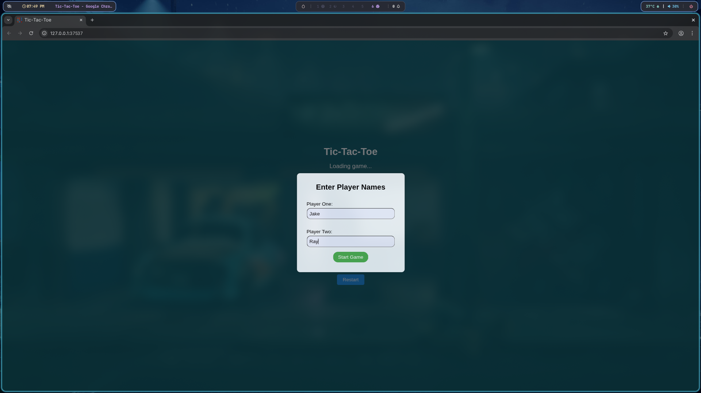
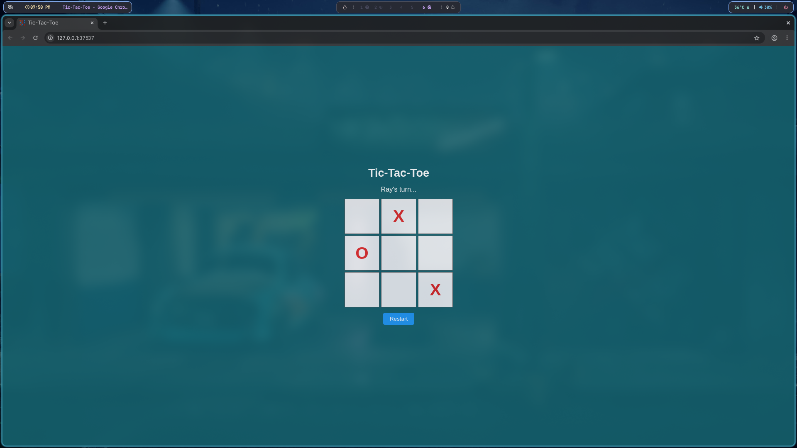
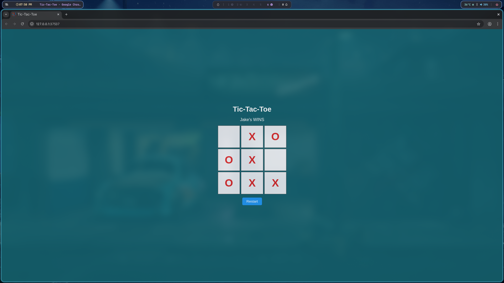

🎮 Tic-Tac-Toe

A fully functional Tic-Tac-Toe game built using HTML, CSS, and Vanilla JavaScript. This project demonstrates fundamental principles of modular JavaScript, DOM manipulation, and event handling, wrapped in a clean and responsive UI.

Tic-Tac-Toe Icon
🚀 Features

    🎯 Classic 2-player Tic-Tac-Toe gameplay.

    🧍 Custom player name input using a modal dialog.

    📱 Responsive and modern user interface.

    🔁 Restart button to reset the game.

    🏆 Win detection and draw handling.

    🧠 Modular JavaScript structure using function factories.

🛠️ Technologies Used

    HTML5 – Structure and layout

    CSS3 – Styling and responsiveness

    JavaScript (ES6+) – Game logic and interaction

📂 Project Structure

tic-tac-toe/
├── index.html
├── assets/
│ ├── css/
│ │ └── styles.css
│ ├── js/
│ │ └── script.js
│ └── img/
│ └── tic-tac-toe.png

▶️ How to Run

    Clone or download this repository.

    Open index.html in any modern web browser.

    Enter player names in the dialog.

    Enjoy the game!

🧩 Game Logic Overview

    GameBoard(): Manages the 2D grid of cells.

    Cell(): Stores and updates the state of individual cells.

    GameController(): Handles turn-taking, win/tie logic, and move validation.

    ScreenController(): Renders the UI and handles DOM interactions.

    Dialog Input: Uses native <dialog> to collect player names at game start.

📸 Screenshots

### 🎬 Start Screen

### 🕹️ Gameplay

### 🏁 Win State

📦 Dependencies

No external libraries or frameworks are used. Everything is written in vanilla JavaScript.
🎨 Icons

    Icon used in this project:

        Tic Tac Toe Icons by Freepik - Flaticon

📃 License

This project is open-source and available under the MIT License.
